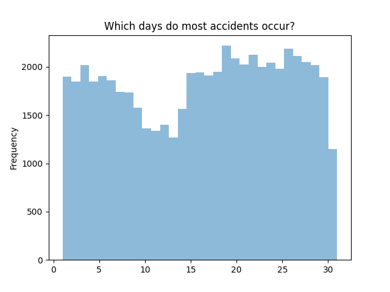
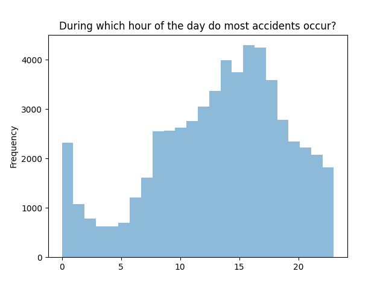
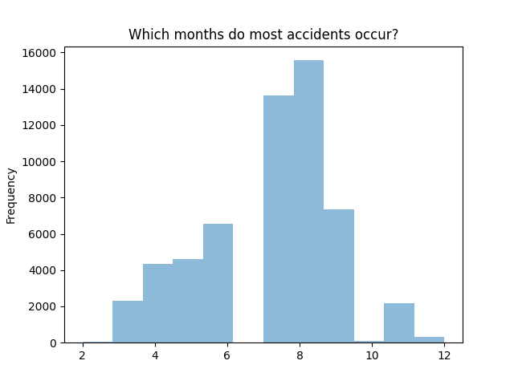
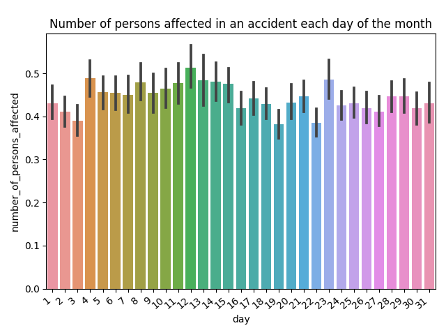
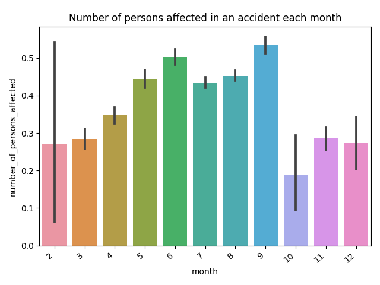
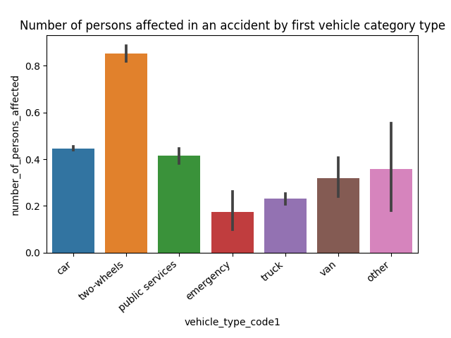
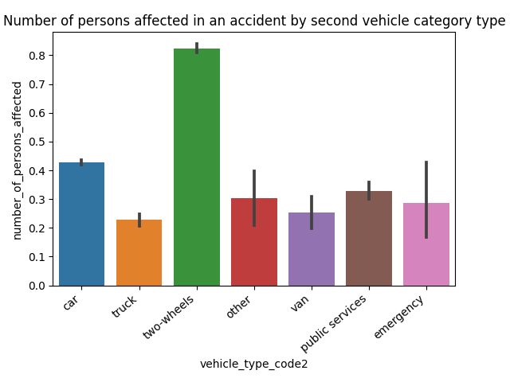

# Data preprocessing - NYC Motor Vehicle Crashes cleaning dataset project

Be able to use pandas
Be able to clean a data set
Be able to do prepare a data set for a machine learning model

Purpose: Clean a messy dataset to apply a machine learning model to eat afterwards.

## Must-have features

    [x] The dataset contains no missing values ("" or null)
    [x] No duplicates.
    [x] Values are consolidated
    [x] Data format is correct
    [x] No blank spaces (ex: " I love python " => "I love python")

## Nice-to-have features

    The more rows of data you use, the better. 
    However, pay attention that the more data you have, the longer each operation needs to execute.
    Shape: (56996 rows, 17 columns)
    
    Add new features computed using the features present that you think are going to be useful.
    Apply the preprocessing steps needed so that a future machine learning model can make the best use out of it (you decide):
        - feature selection 
        - feature engineering
        - feature normalization
        - resampling

## How?

A dataset of 100.000 rows was chosen, spanning from 2018-2019.
Columns with more than 50% of missing values were removed.
The remaining rows with missing values were removed.
This reduced our dataset by 43%. Still an acceptable number of data points left.

Our target column was the 'number_of_persons_affected.
It was created by adding the 'number_of_persons-killed' and ''number_of_persons-injured'.
Our future goal is to be able to predict the conditions that led to persons being affected by an accident.
Once we are able to predict that we will be able to think about different strategies to prevent it.

## Deliverables

    Publish your source code on the GitHub repository.
    Create final .csv file with the cleaned dataset
        - Check cleaned_df.csv
  

## Graphs representing the data

## Pending things to do
- Dummy variables on categorical variables

### Who?
Solo project
### When?
Timeframe: 2 days
